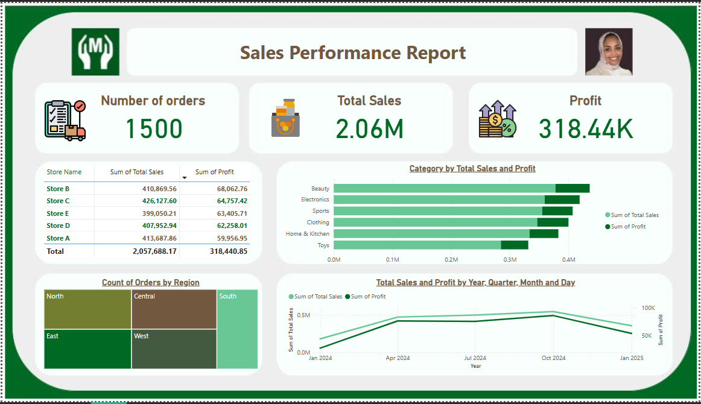

# sales-performance-dashboard
Power BI dashboard analyzing sales, profit, and order trends by store, category, and region.

## 📊 Overview

This Power BI dashboard provides a comprehensive overview of sales performance across different stores and product categories.

### Key Metrics
- **Total Number of Orders:** 1500
- **Total Sales:** 2.06M
- **Total Profit:** 318.44K

### 📌 Visual Insights
- **Top Performing Categories** by Sales and Profit
- **Orders Distribution** by Region
- **Sales and Profit Trends** over Time
- **Store-wise Sales & Profit Analysis**

## 🔧 Tools Used
- Power BI Desktop
- Power Query (for data cleaning)
- DAX (for measures and KPIs)

## 🚀 How to Use
Open the `.pbix` file in Power BI Desktop. Also you can chick files to see the Screenshot of the
 a visual overview of the final dashboard.

---

Made by Aala Omer Taha
